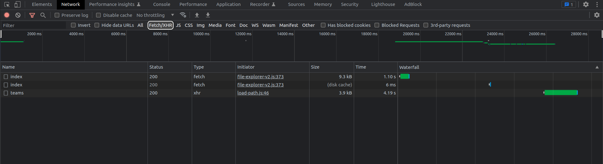

# Basic concept
## Summary
- [Basic concept](#basic-concept)
  - [Summary](#summary)
  - [What we are testing?](#what-we-are-testing)
  - [Directory files explanation](#directory-files-explanation)
    - [cucumber.js](#cucumberjs)
    - [environment.js](#environmentjs)
    - [e2e-test/models](#e2e-testmodels)
    - [e2e-test/step-definitions](#e2e-teststep-definitions)
    - [e2e-test/features](#e2e-testfeatures)
    - [e2e-test/Utils](#e2e-testutils)
  - [Work with PlayWright](#work-with-playwright)
    - [Pages](#pages)
    - [Selectors](#selectors)
    - [Difference between pages and frames](#difference-between-pages-and-frames)
    - [Perform a operation and synchronized the page](#perform-a-operation-and-synchronized-the-page)
  - [Work with our Runner](#work-with-our-runner)

  

## What we are testing?
Automatic testing is a process in which software tests are automatically run by a computer, without the need for human intervention. 

## Directory files explanation

The directory will have a tree similar to this
```sh
.
├── cucumber.js
├──  e2e-test
|   ├── debugfeatures
│   ├── features
│   ├── models
│   ├── step-definitions
│   └── Utils
├── environment.js
├── node_modules
├── package.json
├── package-lock.json
└── tsconfig.json
```
### cucumber.js

This file contains the runner parameter configuration ([See runner](./running.md))

We can find all parameters of the target environment listed as a module export

### environment.js

In this file all the test target environments are listed, the syntax is like this:
```javascript
module.exports = { 
    AUTO_Parameters: {
        basePPOUrl: "url",
        basePIUrl: "url2",
        mockANIAUrl: "url3",
        baseDBUrl: "url connection",
        credentialDB: { username: "username", password: "password" },
        PIContext: "PASS INS Context"
  },
  ...
 }
```

### e2e-test/models

This folder contains all the pages or cards scripts . They are typescript classes that extend the ModelPage class ([See RGI Common](./rgi_common.md)). 

These files can have different suffixes based on the type of item they are (*.page.ts* in case it's a page or *.card.ts* if it's a card inside a page ).

### e2e-test/step-definitions

In this folder, we insert the files containing the cucumber steps, all files will have a suffix like *.steps.ts*.

### e2e-test/features


This folder contains the feature files written in Gherkin language that describe our test case.

By convention, the names of the feature files must be explanatory of their function, written in Italian and with the first capital letter

### e2e-test/Utils

This folder is used to collect those libraries tailored to the project and which will have a general utility *(e.g. a function that generates a valid license plate)*

## Work with PlayWright

### Pages
The class we are working on and which refers to the page/card is extended by the ModelPage class. Each page has a method to instantiate it. To use the page and its methods we must first call this method passing an object of type Page as a parameter

**Each different view has a different page.**
```typescript
check(page:Page){}
```

### Selectors

All classes contain private attributes called selectors which uniquely identify the objects on the page

Selector uses most common jQuery syntax but PlayWright adds very interesting element localization functions, such as being able to use the page layout to search for elements with the most difficult to identify selectors (More info on the PlayWright [docs](https://playwright.dev/docs/locators)).

### Difference between pages and frames
In the Playwright library, a "page" represents a single web page that is being viewed in a browser.

A "frame" represents an HTML **iframe** element within a web page. An iframe is used to embed another web page within the current page, and it has its own DOM (Document Object Model) and JavaScript context separate from the parent page

In our case we manage the frame with a method called *jumpWithSelector(selector)* in class ModelPage. This function returns a Frame object, usable as a parameter in the check method of the new page

```typescript
Then("I jump into a frame", async function(this:OurWorld){
    await BeforePage.someOperation()
    await MyNewFrame.check(await BeforePage.jumpWithSelector('iframe'))
    await MyNewFrame.otherThings()
})
```
### Perform a operation and synchronized the page

When we perform an operation that triggers a request potentially the browser may no longer be synchronized with the runner, that’s why these operations are performed in a special structure called Promise that allows you to parallelize the operations that take place inside

```typescript
//waitResponseByMethod(path, method, timeout)

await Promise.all([
            MyPage.waitResponseByMethod('api/rest/nmf/', 'PUT', 50000),
            MyPage.page.locator(MyPage.buttonOK).click()
        ])
```

To view the requests generated by the page you can use the DevTool browser in the network section (activate xhr/fetch filter). Looking then at the request waterfall evaluate which is the last request that is generated or the most durable


*In this example I will choose '/teams' because it is executed as last*</img>


## Work with our Runner


In all the steps you will see that a **OurWorld** will be passed as a parameter, it contains all the information of the test and is shared between the scenarios.

```typescript
Then("Open browser page", async function(this:OurWorld){
    this.page.goto("http://google.com/")
})
```

Our runner allows you to share data between the steps of the same scenario via **this.share**, a key-value map

The solution for passing values ​​between two scenarios is different, in this case we use the Globalshare, an external library which always creates a key-value map but on a redis server [See more on RGI Common](./rgi_common.md). When we need to pass a variable between scenarios we have to add two steps that will make sure that the scenario from which I'm taking the variable has passed and to identify the variable. Like that:
```gherkin
Feature:name
  Scenario:Creazione contraente
    And ...
    ...
  Scenario:Emissione polizza
    Given Ensure scenario "Creazione contraente"
    And Read global "newParty" from scenario "Creazione contraente"

```
We have two other very used data structures: **this.output** (a key-value map that saves the data in the report output) and **this.attach**, a string that is 'attached' to the execution of a step and will be printed in the report whether the step is passed or not


---

[[Return to main page](./main-page-nrt.md)] - [[Previuous chapter (Setup)](./setup.md)] - [[Next chapter (RGI common)](./rgi_common.md)]