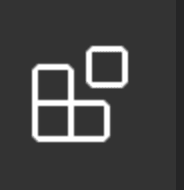

# Setup

- [Setup](#setup)
  - [Node and npm](#node-and-npm)
    - [Windows](#windows)
    - [Ubuntu](#ubuntu)
  - [Playwright](#playwright)
  - [Docker](#docker)
    - [Windows](#windows-1)
    - [Ubuntu](#ubuntu-1)
  - [Visual Studio Code (VSCode)](#visual-studio-code-vscode)
  - [Setup existing project](#setup-existing-project)


To be able develope automatic NRT we need install on the workstation this components/tools/framework:

* node and npm
* Playwright
* Docker
* Develope IDE (recommended Visual Studio Code)

## Node and npm

### Windows

Download the Node.js Windows installer from the official [Node.js website](https://nodejs.org/en/download/).

Run the installer. This will install Node.js, npm and add it to your PATH environment variable.

To check installation, type in Command Prompt:
```sh
node -v
npm -v
```
### Ubuntu

```sh
sudo apt install nodejs
sudo apt install npm
```

to check installation

```sh
node -v or node –version
npm -v or npm –version
```

## Playwright
*This method use the Playwright native runner (npx), in our projects we use our own runner based on Cucumber*

Create a folder and inside it run this command

```sh
npm init playwright@latest
```

## Docker

### Windows

Download the Docker Desktop installer from the [Docker page](https://www.docker.com/products/docker-desktop)

Double-click on the downloaded .exe file to start the installation process.

Follow the prompts to install Docker Desktop on your system. This will install the Docker Engine, as well as other tools such as Docker Compose and Docker CLI.

Once the installation is complete, click on the Docker icon in the system tray to launch the Docker Desktop application.

To check installation, write in cmd

```sh
docker --version
```

### Ubuntu

Follow instruction on official [Docker page](https://docs.docker.com/engine/install/ubuntu/). Below you can find a cndensed version.

Before you install Docker Engine for the first time on a new host machine, you need to set up the Docker repository. Afterward, you can install and update 

```sh
sudo apt-get update
sudo apt-get install ca-certificates curl gnupg lsb-release
sudo mkdir -p /etc/apt/keyrings
curl -fsSL https://download.docker.com/linux/ubuntu/gpg | sudo gpg --dearmor -o /etc/apt/keyrings/docker.gpg
echo "deb [arch=$(dpkg --print-architecture) signed-by=/etc/apt/keyrings/docker.gpg] https://download.docker.com/linux/ubuntu \
  $(lsb_release -cs) stable" | sudo tee /etc/apt/sources.list.d/docker.list > /dev/null
```

install docker 

```sh
sudo apt-get update
sudo apt-get install docker-ce docker-ce-cli containerd.io docker-compose-plugin
```

## Visual Studio Code (VSCode)

Download from the [official site](https://code.visualstudio.com/) the last version available for your operative system (you can find at bottom of the official page setup download).

VSCode offer a large catalog of plugins we can suggest some of them very useful to accelerate and semplify develop activities:

* Gitlens - Git supercharged
* Docker Extension Pack
* JavaScript and TypeScript Nightly
* npm Intellisense
* Cucumber (Gherkin) Full Support

To install extension click on **Extensions** icon on the left sidebar of the IDE:

</img>

on the top you will find a search box where type your search terms. When you find desired extension click on **install** blue button near the description of the extension

## Setup existing project

To setup a existing NRT project in your local workspace, you need to run the following commands

```sh
git clone <repo-url>
cd <repo>
npm install
```

---

[[Return to main page](./main-page-nrt.md)] - [[Next chapter (Basic concept)](./basic_concept.md)]